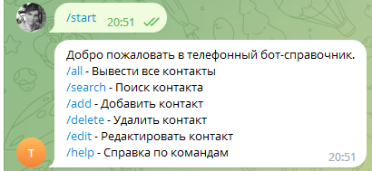
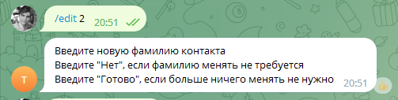

# Описание работы программы

Телеграм-бот phonebook_bot - это телефонный справочник с управлением через Телеграм.

Все контакты справочника хранятся в файле формата JSON в папке, где находится бот.

По каждому контакту хранится его id, Фамилия, Имя, Отчество и неограниченное количество телефонов.

Для работы в Телерам-боте используются следующие команды:

Часть команд работают без параметров (/all, /add, /help)

Часть команд работают с обязательным параметром, который нужно вводить через пробел после самой команды

(Например, /search Иванов будет искать во всех контактах по все полям слово "иванов")

